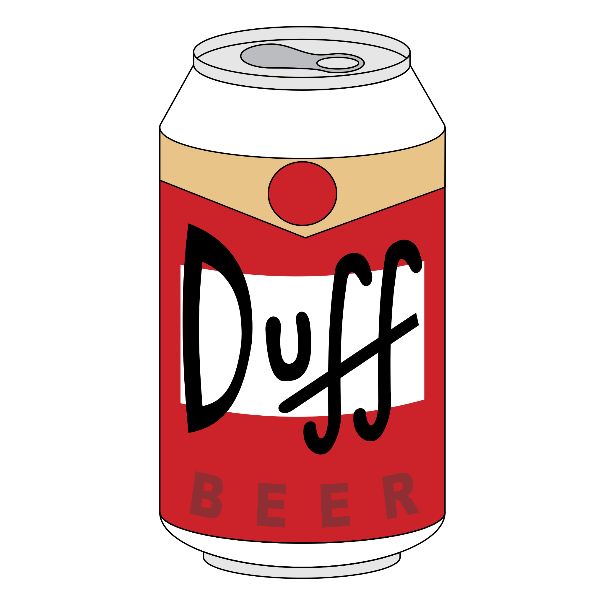

<!-- PROJECT HEADER -->
<br />
<p align="center">
  <a href="https://github.com/tim-corley">
    
  </a>

  <h2 align="center">Foobar Brewing Co. Website</h2>

  <p align="center">
    a static, responsive marketing website built with a mobile-first approach
    <br />
    <br />
    <a href="https://github.com/tim-corley">View Demo</a>
    ·
    <a href="https://github.com/tim-corley/foobar-brewing-website/issues">Report Bug</a>
  </p>
    <div align="center">
    <h3>Built with:<h3>
      <a href="https://html.spec.whatwg.org/">
    
  </a>
    <a href="https://www.npmjs.com/package/node-sass">
    
  </a>
  </div>
</p>

<!-- TABLE OF CONTENTS -->
<details open="open">
  <summary>Table of Contents</summary>
  <ol>
    <li>
      <a href="#about-the-project">About The Project</a>
      <ul>
        <li><a href="#built-with">Built With</a></li>
      </ul>
    </li>
    <li>
      <a href="#getting-started">Getting Started</a>
      <ul>
        <li><a href="#prerequisites">Prerequisites</a></li>
        <li><a href="#installation">Installation</a></li>
      </ul>
    </li>
        <li>
      <a href="#dev-notes">Dev Notes</a>
      <ul>
        <li><a href="#sass">Sass</a></li>
        <li><a href="#responsive-design">Responsive Design</a></li>
      </ul>
    </li>
    <li><a href="#license">License</a></li>
    <li><a href="#contact">Contact</a></li>
  </ol>
</details>

<!-- ABOUT THE PROJECT -->
## About The Project
---

[![Product Name Screen Shot][product-screenshot]](https://example.com)

This is a relatively simple web development project intended to be used as a starter template for other website projects.

### Built With

* [HTML](https://html.spec.whatwg.org/)
* [Sass](https://sass-lang.com/)
* [Node-Sass](https://www.npmjs.com/package/node-sass)

<!-- GETTING STARTED -->
## Getting Started
---

Follow the steps below to get a local development instance up & running.

### Prerequisites

This is an example of how to list things you need to use the software and how to install them.
* node
  
  [Install Node](https://nodejs.org/en/download/) - or on macOS:
  ```sh
  brew install node
  ```
* npm
  ```sh
  npm install npm@latest -g
  ```

### Installation


1. Clone the repo
   ```sh
   git clone https://github.com/tim-corley/foobar-brewing-website.git
   ```
2. Install NPM packages
   ```sh
   npm install
   ```
3. Have Node-Sass watch your .scss files and compile them to .css
   ```sh
   npm run sass
   ``` 
4. Start Live Server via your IDE

<!-- DEVELPOMENT NOTES -->
## Dev Notes
---

### Sass

> SassScript is a preprocessor scripting language that is compiled into CSS. There are two different syntaxes - `.sass` (uses indentation & newline characters) and `.scss` (the more modern option, uses blocks like regular css). The purpose of Sass is to make it easier to work with large stylesheets that have lots of classes & ids.

https://sass-lang.com/guide

#### Variables
 - define a variable with the `$` symbol above the style block
  ```
    $font-stack:    Helvetica, sans-serif;
    $primary-color: #333;

    body {
    font: 100% $font-stack;
    color: $primary-color;
    }
  ```

#### Nesting
 - mimic the HTML hierarchy to make the css more readable / easier to maintain
  ```
    nav {
    ul {
        margin: 0;
        padding: 0;
        list-style: none;
    }

    li { display: inline-block; }

    a {
        display: block;
        padding: 6px 12px;
        text-decoration: none;
    }
    }
  ```

#### Partials
 - keep css modular by using partials - little snippets of code meant to be used elsewhere. Defined using an underscore: `_partial.scss` and imported with `@use`. Partials will not be compiled into css files.

#### Modules 
```
    // _base.scss
    $font-stack:    Helvetica, sans-serif;
    $primary-color: #333;

    body {
    font: 100% $font-stack;
    color: $primary-color;
    }
```
```
    // styles.scss
    @use 'base';

    .inverse {
    background-color: base.$primary-color;
    color: white;
    }
```

#### Mixins
 - like functions for css. Can group declaration - and pass in values - to reuse throughout the code.
```
    @mixin transform($property) {
    -webkit-transform: $property;
    -ms-transform: $property;
    transform: $property;
    }
    .box { @include transform(rotate(30deg)); }
```

#### Extend/Inheritance
 - share a set of css properties from one selector to another by using `@extend`. Helps keep Sass DRY
```
    /* This CSS will print because %message-shared is extended. */
    %message-shared
    border: 1px solid #ccc
    padding: 10px
    color: #333


    // This CSS won't print because %equal-heights is never extended.
    %equal-heights
    display: flex
    flex-wrap: wrap


    .message
    @extend %message-shared


    .success
    @extend %message-shared
    border-color: green


    .error
    @extend %message-shared
    border-color: red


    .warning
    @extend %message-shared
    border-color: yellow
```

#### Operators
 - do basic math
```
    .container
    width: 100%


    article[role="main"]
    float: left
    width: 600px / 960px * 100%


    aside[role="complementary"]
    float: right
    width: 300px / 960px * 100%
```

### Responsive Design

> Responsive design enables your site to look good & make sense on all device type - from large desktop monitors to small cell phones. 

https://developer.mozilla.org/en-US/docs/Learn/CSS/CSS_layout/Responsive_Design

https://material.io/design/layout/responsive-layout-grid.html#breakpoints

https://web.dev/responsive-web-design-basics/

#### Breakpoints & Media Queries
 - Selectively apply CSS based on some specified property - such as screen, print, speech. 
 - A breakpoint is the range of predetermined screen sizes that have specific layout requirements. At a given breakpoint range, the layout adjusts to suit the screen size and orientation.
 - A Media Query will implement styling changes when it register a breakpoint change.
#### Flexbox & Grid

**Flexbox**

https://css-tricks.com/snippets/css/a-guide-to-flexbox/

 - A way to lay out, align and distribute space among items in a container
 - Using flex consists of at least two items - a parent element (flex container) and a child element (flex item)

**Grid**

https://css-tricks.com/snippets/css/complete-guide-grid/


<!-- LICENSE -->
## License
---

Distributed under the MIT License. See `LICENSE` for more information.


<!-- CONTACT -->
## Contact
---

Tim Corley - [@tcor215](https://twitter.com/tcor215) - contact@tim-corley.dev


[product-screenshot]: assets/screenshot.png